Ground Truth = Crowdsourced Segment  
Grabcut 1 = Edge mask + hard extreme points / centroid / skeleton  
Grabcut 2 = Edge mask + hard extreme points / skeleton  
DEXTR 1 = COCO Pretrained  
DEXTR 2 = COCO Pretrained + finetuned 1 epoch on 1.5K samples from Grabcut 1  

DEXTR 1 and DEXTR 2 achieve ~ 76.5% mIOU  
Grabcut 1 and Grabcut 2 achieve ~ 72.4% mIOU  

#### Animal  
#### Original Image | Ground Truth | Grabcut 1 | Grabcut 2 | DEXTR 1 | DEXTR 2  
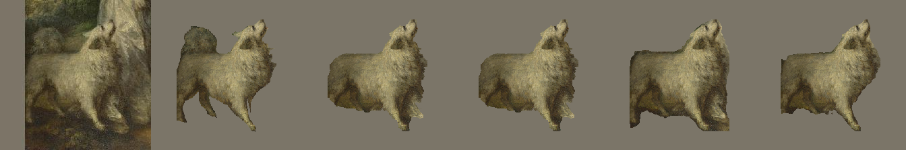  
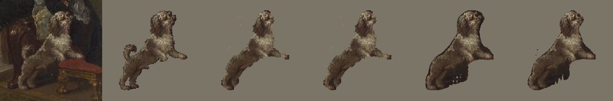  
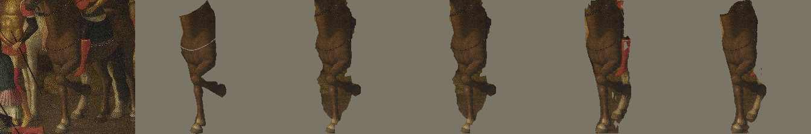  
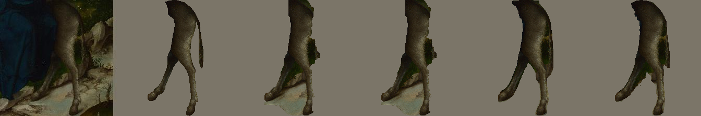  
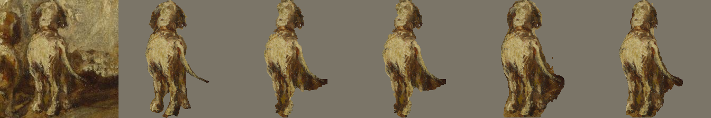  
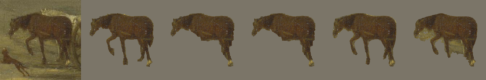  
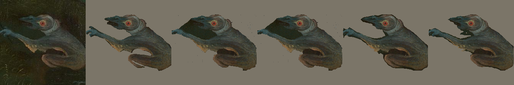  
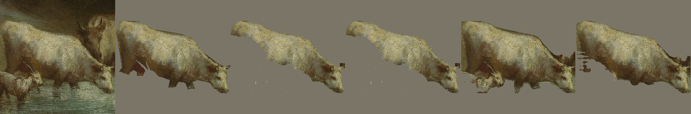  
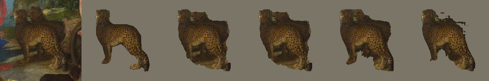  
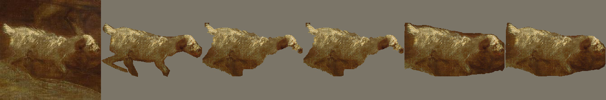  
#### Ceramic  
#### Original Image | Ground Truth | Grabcut 1 | Grabcut 2 | DEXTR 1 | DEXTR 2  
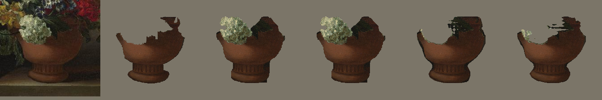  
  
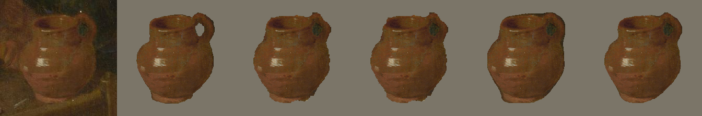  
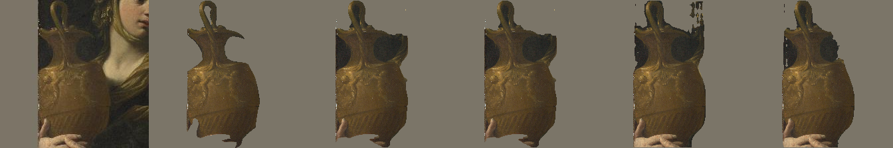  
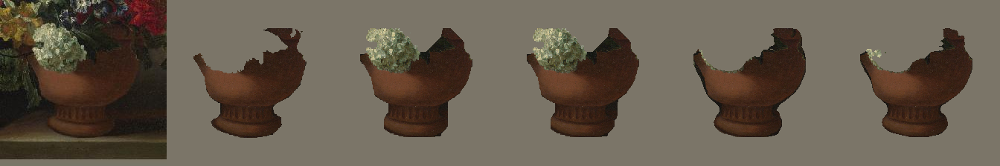  
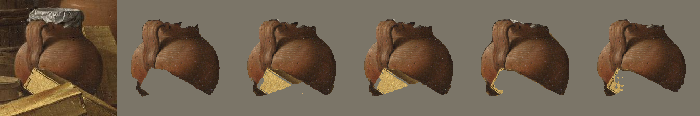  
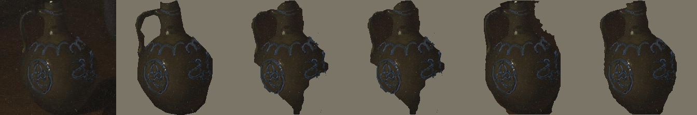  
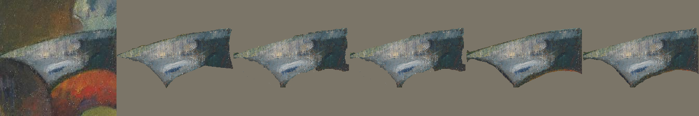  
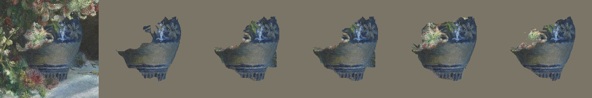  
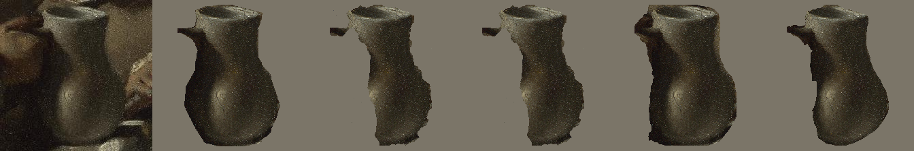  
#### Fabric  
#### Original Image | Ground Truth | Grabcut 1 | Grabcut 2 | DEXTR 1 | DEXTR 2  
  
  
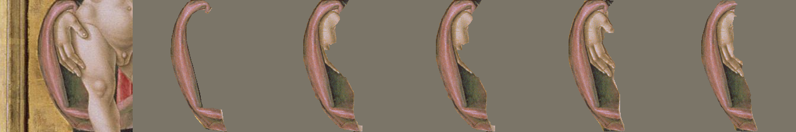  
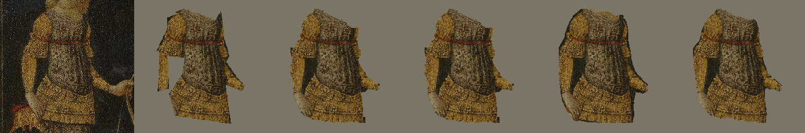  
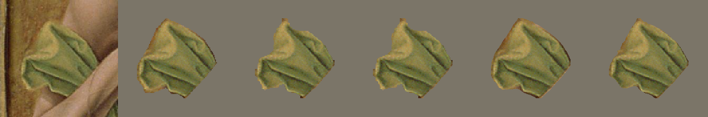  
  
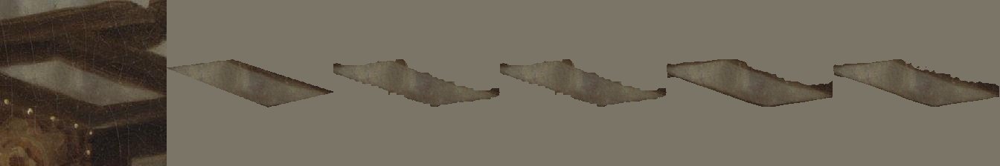  
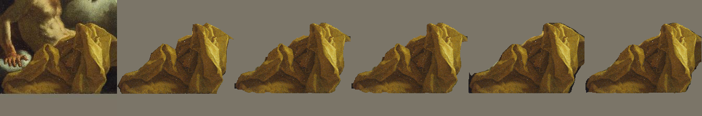  
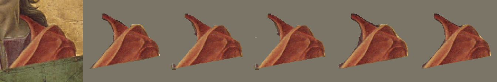  
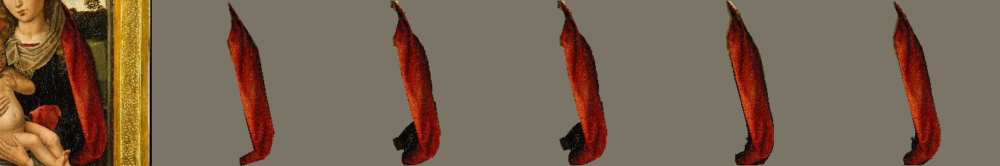  
#### Foliage  
#### Original Image | Ground Truth | Grabcut 1 | Grabcut 2 | DEXTR 1 | DEXTR 2  
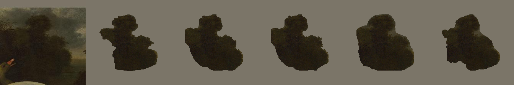  
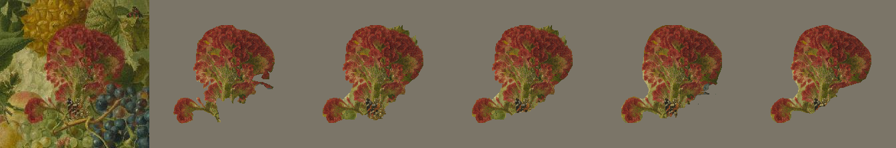  
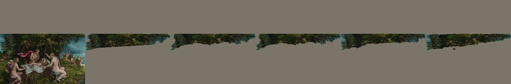  
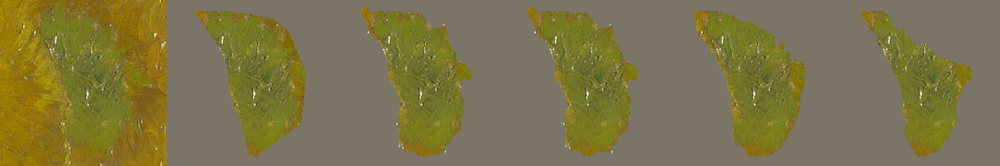  
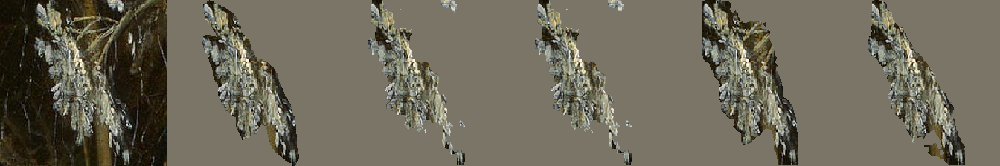  
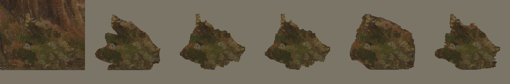  
  
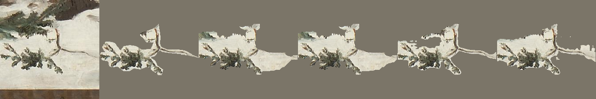  
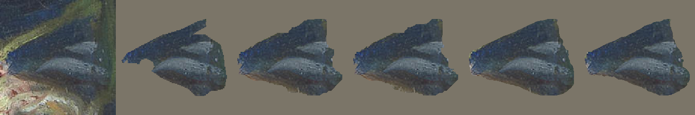  
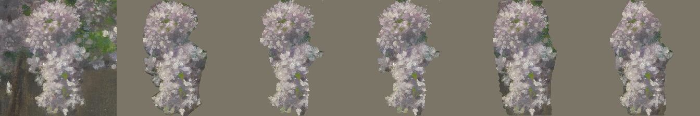  
#### Food  
#### Original Image | Ground Truth | Grabcut 1 | Grabcut 2 | DEXTR 1 | DEXTR 2  
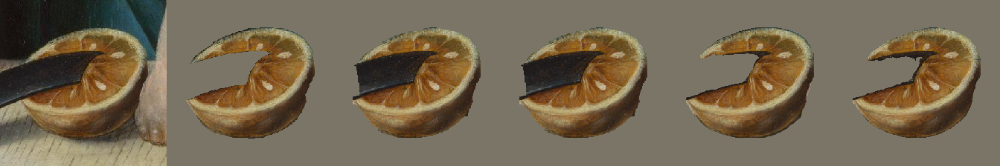  
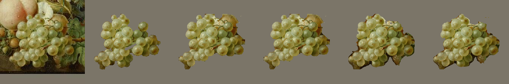  
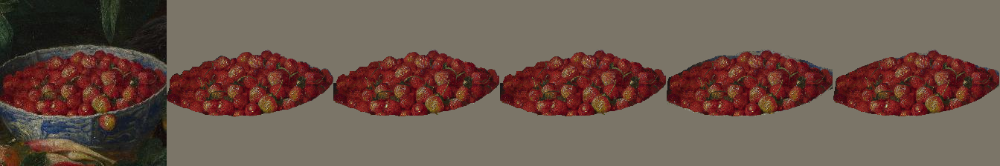  
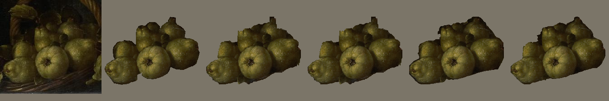  
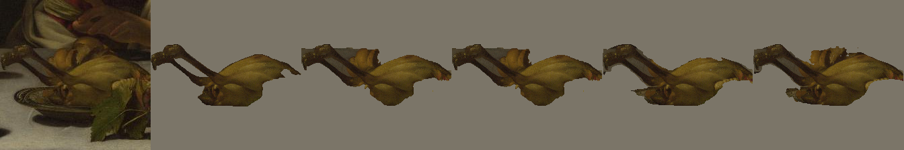  
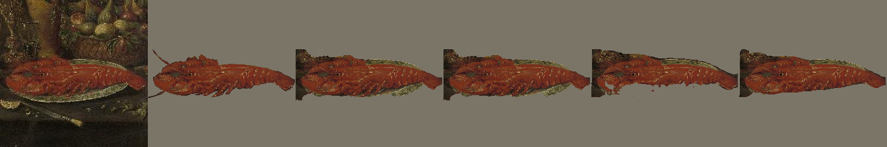  
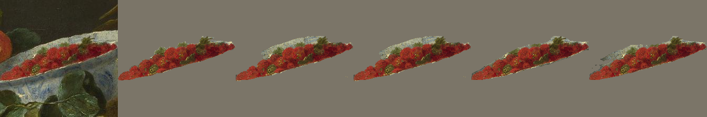  
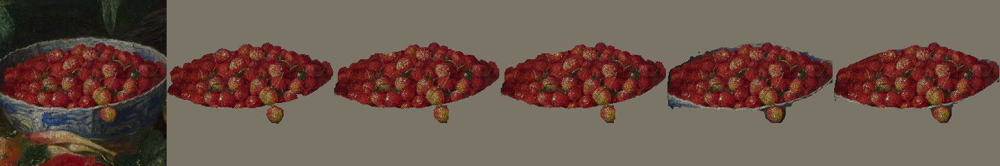  
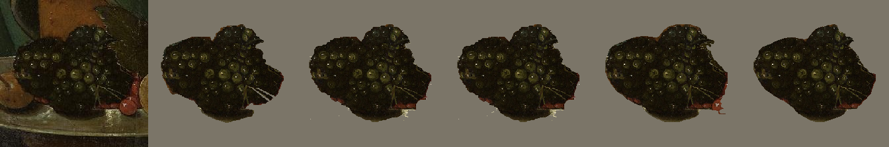  
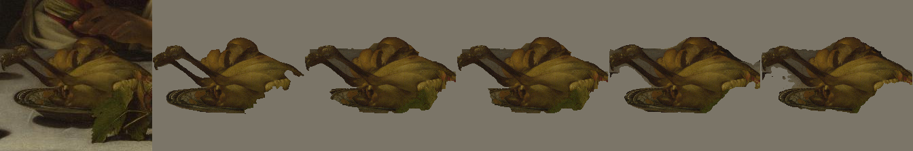  
#### Gem  
#### Original Image | Ground Truth | Grabcut 1 | Grabcut 2 | DEXTR 1 | DEXTR 2  
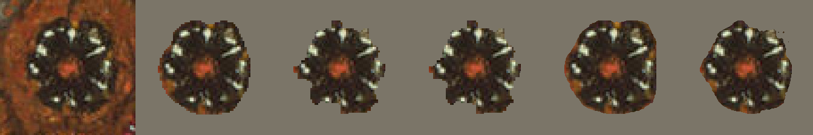  
  
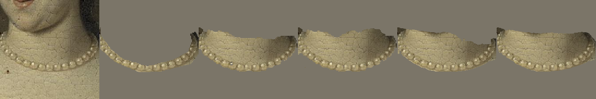  
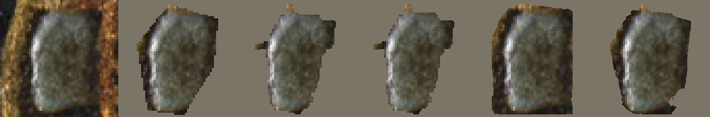  
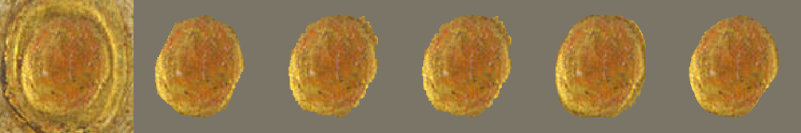  
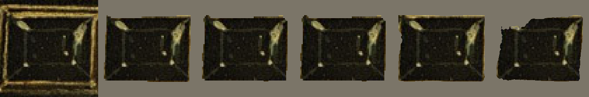  
  
  
  
  
#### Glass  
#### Original Image | Ground Truth | Grabcut 1 | Grabcut 2 | DEXTR 1 | DEXTR 2  
  
  
  
  
  
  
  
  
  
  
#### Ground  
#### Original Image | Ground Truth | Grabcut 1 | Grabcut 2 | DEXTR 1 | DEXTR 2  
  
  
  
  
  
  
  
  
  
  
#### Liquid  
#### Original Image | Ground Truth | Grabcut 1 | Grabcut 2 | DEXTR 1 | DEXTR 2  
  
  
  
  
  
  
  
  
  
  
#### Metal  
#### Original Image | Ground Truth | Grabcut 1 | Grabcut 2 | DEXTR 1 | DEXTR 2  
  
  
  
  
  
  
  
  
  
  
#### Paper  
#### Original Image | Ground Truth | Grabcut 1 | Grabcut 2 | DEXTR 1 | DEXTR 2  
  
  
  
  
  
  
  
  
  
  
#### Skin  
#### Original Image | Ground Truth | Grabcut 1 | Grabcut 2 | DEXTR 1 | DEXTR 2  
  
  
  
  
  
  
  
  
  
  
#### Sky  
#### Original Image | Ground Truth | Grabcut 1 | Grabcut 2 | DEXTR 1 | DEXTR 2  
  
  
  
  
  
  
  
  
  
  
#### Stone  
#### Original Image | Ground Truth | Grabcut 1 | Grabcut 2 | DEXTR 1 | DEXTR 2  
  
  
  
  
  
  
  
  
  
  
#### Wood  
#### Original Image | Ground Truth | Grabcut 1 | Grabcut 2 | DEXTR 1 | DEXTR 2  
  
  
  
  
  
  
  
  
  
  

